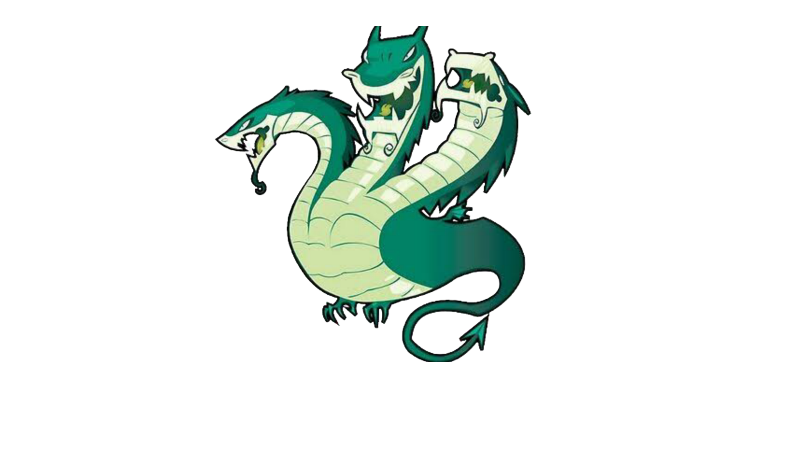

# Termux-Hydra



thc-hydra in termux <br>
Hydra is a parallelized login cracker which supports numerous protocols to attack. It is very fast and flexible, and new modules are easy to add.

This tool makes it possible for researchers and security consultants to show how easy it would be to gain unauthorized access to a system remotely.

It supports: Cisco AAA, Cisco auth, Cisco enable, CVS, FTP, HTTP(S)-FORM-GET, HTTP(S)-FORM-POST, HTTP(S)-GET, HTTP(S)-HEAD, HTTP-Proxy, ICQ, IMAP, IRC, LDAP, MS-SQL, MySQL, NNTP, Oracle Listener, Oracle SID, PC-Anywhere, PC-NFS, POP3, PostgreSQL, RDP, Rexec, Rlogin, Rsh, SIP, SMB(NT), SMTP, SMTP Enum, SNMP v1+v2+v3, SOCKS5, SSH (v1 and v2), SSHKEY, Subversion, Teamspeak (TS2), Telnet, VMware-Auth, VNC and XMPP.

## Instalation on Termux 
```
curl -sL https://tinyurl.com/29mlncp4 | bash
```
